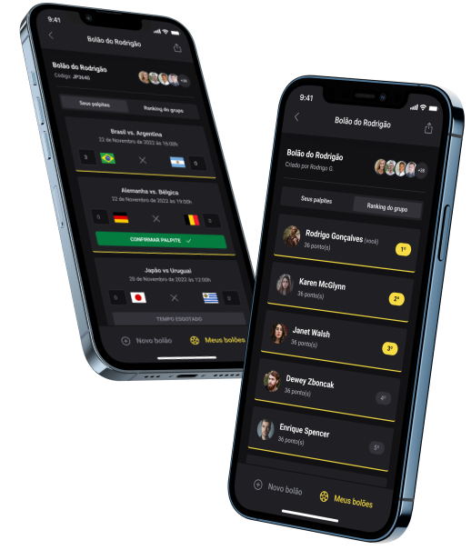

   

# NLW Copa Bolao

#### :postbox: About

- App Bolao created for learning during nlw copa rocketseat

#### :pushpin: Prototype

- [Figma](<https://www.figma.com/file/4JuUW3pP2L4Z4za7Csyfez/Bol%C3%A3o-da-Copa-(Community)?node-id=0%3A1&t=dAFB3OQPVB1mRHA1-0>)

#### :rocket: User Stack

### Web

- [Next JS](https://nextjs.org/)
- [Tailwind CSS](https://tailwindcss.com/)

### Mobile

- [Expo](https://docs.expo.dev/)
- [NativeBase](https://nativebase.io/)

### Server

- [Fastify](https://www.fastify.io/docs/latest/Guides/Getting-Started/)
- [Zod](https://zod.dev/?id=basic-usage)
